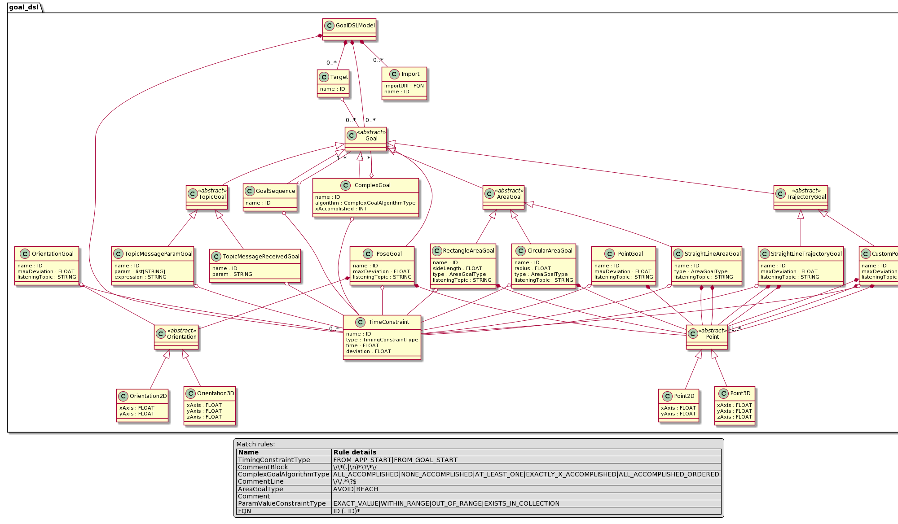

# goal-dsl

Domain-Specific Language for evaluation of IoT applications and system behavior, 
based on **Goals**.

The general idea is that we can define goal rules based on messages arrived
at specific topics. For example, a goal may define a rule to wait until receive an event
or a message on a topic.

To expand this idea to the context of Cyber-Physical Systems, beyond
topic-related Goals, it is useful to be able to define environment-related Goals
for mobile things, such as robots. For example, in robotics it is common
to require definition of Goals related to the Pose of the robot, or to follow a trajectory.


**Goal Types**:
- Topic Goals
- Area Goals
- Pose Goals
- Trajectory Goals
- Complex Goal
- Goal Sequence


## Goal Types

All subclasses of Goal, except TopicGoals have the following **Optional** properties:

- listening: Listening Topic URI
- timeConstraint: Time constraint for the Goal

### Topic Goals

#### TopicMessageReceivedGoal
This Goal is considered **REACHED** when a message arrives at a specific topic,
without any considerations of the payload of the message.

```
TopicMsgReceivedGoal TopicGoalA -> {
    topic: 'robot.opts.face_detection.detected';
}

TopicMsgReceivedGoal TopicGoalD -> {
    topic: 'env.door.kitchen.opened';
}
```

#### TopicMessageParamGoal
Set this Goal for cases where you want to filter messages arrived at a topic
based on an exppression.

```
TopicMsgParamGoal TopicGoalB -> {
    topic: "robot.sensor.motion.speed";
    condition: "linVel" > 10;
}

TopicMsgParamGoal TopicGoalC -> {
    topic: "robot.sensor.motion.speed";
    condition: "angVel" == 10;
}

TopicMsgParamGoal TopicGoalE -> {
    topic: "robot.sensor.qr.detected";
    condition: "msg" == "R4A";
}

TopicMsgParamGoal TopicGoalF -> {
    topic: "robot.sensor.qr.detected";
    condition: ("linVel" > 10) AND ("angVel" < 0.5);
}
```

Conditions syntax is defined by the following grammar:

```
Condition: ConditionGroup | PrimitiveCondition;

ConditionGroup:
    '(' c1=Condition ')' operator=BooleanOperatorType '('
    c2=Condition ')'
;

PrimitiveCondition: StringCondition | NumericCondition;

StringCondition:
    param=STRING operator=StringOperatorType val=STRING
;

NumericCondition:
    param=STRING operator=NumericOperatorType val=NUMBER
;

StringOperatorType: '~' | '!~' | '==' | '!=';
NumericOperatorType: '>' | '<' | '==' | '!=';
BooleanOperatorType: 'AND' | 'OR' | 'NOT' | 'XOR' | 'NOR' | 'XNOR' | 'NAND';
```

Now lets try to strip things down. First of all, a Condition can be either a
PrimitiveCondition or a ConditionGroup. The first is a condition for primitive
data types, such as strings (StringCondition) and numbers (NumericCondition).
ConditionGroup is used to apply boolean operations, e.g:

```
(("linVel" > 10) AND ("angVel" < 0.5)) AND ("error" == "");
```

Furthermore, ConditionGroup has two Conditions, which means that nested
Conditions can be crafted based on boolean operations.


### Area Goals

An **AreaGoal** is related areas in the environment which have a meaning for an
application. An example would be the avoidance of specific areas. All Area Goals
have a tag that gives a meaning to the goal

**AreaGoalTags**
- AVOID
- ENTER
- EXIT
- STEP


The first defines area goals which have to be avoided by mobile things, while
the latter an area that has to be "entered". All Area Goals have a `tag`
property.

#### RectangleAreaGoal
A rectangle area defined by (centerPoint, radius) that has to either be reached
or avoided.

```
RectangleAreaGoal GoalA -> {
    bottomLeftEdge: Point2D(2.0, 6.0);
    lengthX: 3.0;
    lengthY: 4.0;
    tag: ENTER;
}
```

#### CircularAreaGoal
A circular area defined by (centerPoint, radius).

```
CircularAreaGoal GoalB -> {
    center: Point2D(2.0, 6.0);
    radius: 3.0;
    tag: AVOID;
}
```

#### PolylineAreaGoal
A polyline area defined by a list of Points.

```
PolylineAreaGoal PolylineAreaExample -> {
    points: [Point2D(0.0, 0.0), Point2D(2.0, 4.0), Point2D(4.0,  0.0)];
    tag: AVOID;
}
```

#### StraightLineAreaGoal
A straight line in the environment, defined by (startPoint, finishPoint) that has to be either reached or avoided.

```
StraightLineAreaGoal StraightLineAreaExample -> {
    startPoint: Point2D(2.0, 7.6);
    endPoint: Point2D(2.0, 7.6);
    tag: AVOID;
}
```

#### MovingAreaGoal
This type of Goal can be used for mobile objects, such as robots.

```
MovingAreaGoal MyRobotAvoid -> {
    radius: 46;  // 46cm
    tag: AVOID;
}
```


### Pose Goals

Pose goals are those related to the pose of a specific thing.
Mostly used in mobile robot applications.

#### PositionGoal
Reach a specific position in space.

```
PositionGoal ExamplePositionGoal -> {
    position: Point2D(0.0, 0.0);
    maxDeviation: 1;  // cm
}
```

#### OrientationGoal
Reach a specific orientation in space.

```
OrientationGoal ExampleOrientationGoal -> {
    orientation: Orientation2D(1.0);  // rad?
    maxDeviation: 0.2; // rad
}
```

#### PoseGoal
Reach a specific pose (orientation, position) in space.

```
PoseGoal ExamplePoseGoal -> {
    position: Point2D(0.0, 0.0);
    orientation: Orientation2D(1.0);  // rad?
    maxDeviationPos: 0.2;
    maxDeviationOri: 0.2;
}
```

### Trajectory Goals

Use this type to define goals for a thing to follow/track a trajectory. Mostly used in mobile robot applications.

#### StraightLineTrajectoryGoal
A straight line trajectory goal, defined by (startPoint, finishPoint,
    maxDeviation).

#### CustomPointsTrajectoryGoal
A straight line trajectory goal, defined by (startPoint, finishPoint,
    trajectoryPoints, maxDeviation).

### Complex Goals

The **ComplexGoal** is used to defined goals which are a collection of goals.
For example, using complex goals, we can define a collection of Goals, from
which at least one has to be accomplished.

Below are the possible types of algorithms to apply for a ComplexGoal
definition.

- **ALL_ACCOMPLISHED**
- **ALL_ACCOMPLISHED_ORDERED**
- **NONE_ACCOMPLISHED**
- **AT_LEAST_ONE**
- **EXACTLY_X_ACCOMPLISHED**
- **EXACTLY_X_ACCOMPLISHED_ORDERED**

```
ComplexGoal GoalC -> {
    algorithm: ALL_ACCOMPLISHED;
    addGoal(GoalA);
    addGoal(GoalB);
}
```

### Goal Sequence

A number of Goals which have to be accomplished in sequence.

```
Sequence S1 -> {
    addGoal(GoalC);
    addGoal(GoalD);
    addGoal(GoalE);
}
```

## Time Constraints for Goals

Goals can have time constraints, like maximum duration from previous goal.
For this reason we introduce the **TimeConstraint** concept, which allows the definition of time constraints.

```
TimeConstraint: TimeConstraintDuration;


TimeConstraintDuration:
    type=TimingConstraintType '(' comparator=TCComparator time=FLOAT ')'
;
```

Each TimeConstraint can measure time relative to either the start of
the application or the start of the current goal. This can be defined using the
`type` property of **TimeConstraint** classes and can have one of the following
values.

- **FROM_APP_START**
- **FROM_GOAL_START**

The `comparator` can have one of the values `>`,
`<` and `==`.

An example time constraint::

```
TopicMsgReceivedGoal TopicGoalA -> {
    topic: "robot.opts.face_detection.detected";
    timeConstraints: [FROM_GOAL_START(< 10.0)];
}
```

In the above example the constraint indicates that **The duration of the Goal must not exceed 10
seconds.


## Communication Middleware / Message Broker

In GoalDSL it is possible to define the communication middleware to use, built
on to of message broker technologies. This
is relevant to the same communication middleware the under-investigation
application uses.

Currently, three types of **CommunicationMiddleware** are supported by the DSL.
These are listed below among with their properties.

- AMQPBroker
  - host (str): Hostname to connect to
  - port (int): AMQP port to connect
  - vhost (str): Vhost to connect
  - exchange (str): Exchange to use for Topic-based pubsub communication
  - auth
    - Plain Authentication: AuthPlain(username, password)
- MQTTBroker
  - host (str): Hostname to connect to
  - port (int): Redis port to connect
  - auth
    - Plain Authentication: AuthPlain(username, password)
- RedisBroker
  - host (str): Hostname to connect to
  - port (int): Redis port to connect
  - db (int): Redis database instance to connect
  - auth
    - Plain Authentication: AuthPlain(username, password)

Below is an example of a RedisBroker definition.

```
RedisBroker MyMiddleware -> {
    host: 'localhost';
    port: 6379;
    db: 0;
    auth: AuthPlain('', '');  // AuthPlain(username, password)
}
```


## Target

**Target** defines a set of goals which are assigned to be executed for a
specific target/application. A target needs to be linked to a specific
middleware (message broker). Each model can have **ONLY ONE** target.

A **Target** is defined by a list of Goals and a communication middleware. 

```
import complex_goals.goal as complex;
...

Target MyAppTarget -> {
    goals: [complex.GoalC, complex.GoalD, complex.GoalE];
    middleware: MyMiddleware;  // Reference a previously defined Middleware
}
```


## Other Concepts

### Point

In order to be able to define points in 2D and 3D space, the **Point2D** and
**Point3D** classes are introduced.

The syntax for defining a Point.

```
Point2D(x, y)

Point3D(x, y, z)
```

### Orientation

In order to be able to define the orientation of things in 2D and 3D space,
   the **Orientation2D** and **Orientation3D** classes are introduced.

The syntax for defining a Point.

```
Orientation2D(z)  // In 2D space only zAxes rotation is allowed.

Orientation3D(x, y, z)
```

## Metamodel of the Language

The metamodel of the DSL, defines the concepts of the language.




## Multiple model files -  Import models

The language supports multi-file models via model imports.
A nested model import layer is implemented, enabling pythonic imports
of models defined in other files.

```
// File area_goals.goal

RectangleAreaGoal GoalA -> {
    centerPoint: Point2D(2.0, 6.0);
    sideLength: 3.0;
    type: ENTER;
}

CircularAreaGoal GoalB -> {
    centerPoint: Point2D(2.0, 6.0);
    radius: 3.0;
    type: AVOID;
}
```

```
// File complex_goals.goal

// area_goals.goal file exists in current directory.
// Includes GoalA and GoalB goals
import area_goals.goal as area_goals;

ComplexGoal GoalC -> {
    algorithm: ALL_ACCOMPLISHED;
    addGoal(area_goals.GoalA);
    addGoal(area_goals.GoalB);
}
```

## Thoughts

### AreaRoomGoal
Provide Goal types for semantic declaration of reach or avoid areas,
        for example "enter the kitchen".
Even though this can be achieved using the `AreaGoal` goals, such definitions
will be easier to configure. Though, the environment must somehow post
the current room location of the thing in order to be able to operate. This also
means that the environment must be semantically annotated.

### Add Scoring in Language

Assign score metrics/weights/etc on goals.
Scores can be defined when defining the "Target" goals (Goals which will be used
    for a target).

### Anti-Goals

Support setting every Goal in Anti-Goal mode, meaning that it **MUST NOT BE
ACCOMPLISED**. This can be defined as an optional property of all **Goal** classes.
Or define an AntiGoal class that will wrap all Goal classes and make the
anti-goals.

```
TopicMsgReceivedGoal TopicGoalA -> {
    topic: "robot.opts.face_detection.detected";
    antiGoal: True;
}

```

```
TopicMsgReceivedGoal TopicGoalA -> {
    topic: "robot.opts.face_detection.detected";
}

AntiGoal AntiTopicGoalA(TopicGoalA);

```


**Note**: Currently, Area Goals can be set to 'AVOID' or 'REACHED' mode.

## Examples

An example that covers the complete list of features and of the language can
found [here](./examples/)

# Credits

- [klpanagi](https://github.com/klpanagi)
- [imgchris]()
- [etsardou]()
- [asymeo]()